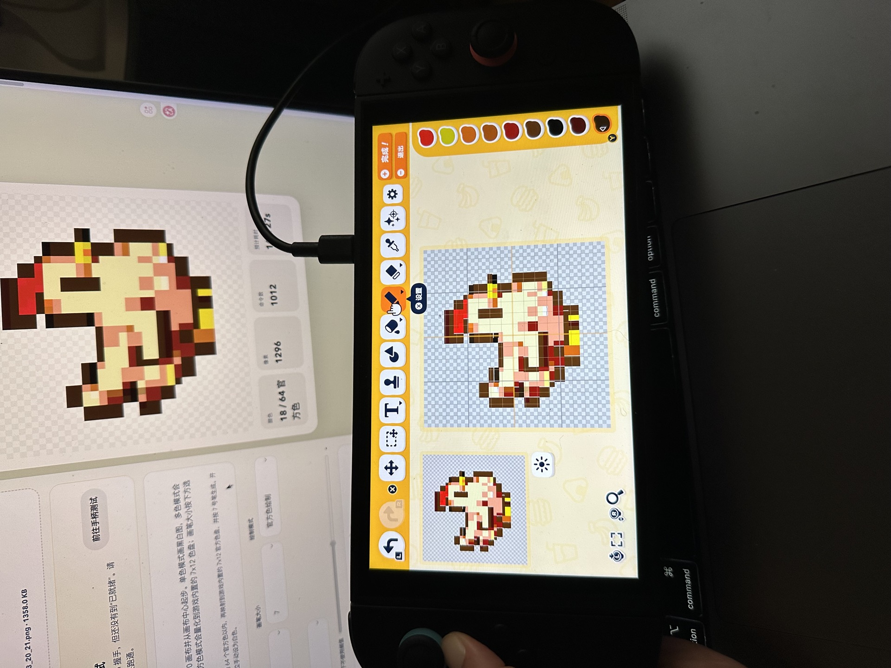
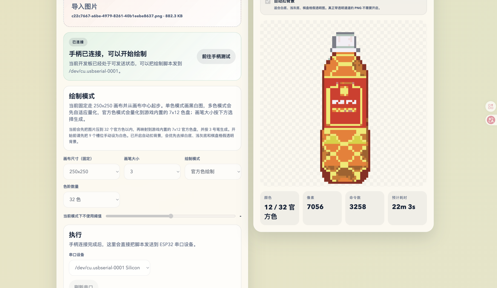

# Friend Maker

[中文说明](#中文说明) | [English](#english)


<p>
  <a href="docs/media/demo-video.mov">
    
  </a>
</p>

<p>
  
  
  
</p>

## 中文说明

`朋友制作器` 是一个面向 `macOS / Windows + ESP32-WROOM-32 / ESP-32S` 的自动绘制工具。  
它会将图片转换成像素网格和手柄动作脚本，再通过 ESP32 模拟 Switch Pro Controller 输入，在游戏画板中自动完成绘制。当前版本主要面向《朋友收集：梦想生活》与 `Tomodachi Life` 的绘图场景。

关键词：`Friend Maker`、`朋友制作器`、`Tomodachi Life`、`朋友收集：梦想生活`、`Nintendo Switch auto draw`、`ESP32 Pro Controller emulator`、`pixel art drawing automation`、`Bluetooth Classic HID`。

### 平台支持

- 完整支持：`macOS`
- 支持手动安装与启动：`Windows`
- 暂未正式支持：`Linux`

当前版本已经提供：

- `macOS` 的完整试用流程与一键启动
- `Windows` 的手动安装与手动启动流程

参考文档：

- [macOS / Windows 试用说明](docs/user-trial-guide.md)
- [Windows 手动安装说明](docs/setup-windows.md)

### 演示

- [查看演示视频](docs/media/demo-video.mov)

### 项目功能

- 导入 `PNG / JPG / SVG` 图片，并生成绘制预览
- 支持 `1 / 3 / 7 / 13 / 19 / 27` 六种画笔大小
- 支持 `单色绘制` 与 `官方色绘制`
- 支持 `256x256` 脚本坐标画布工作流
- 支持 `自动扣背景`，适合白底、浅灰底、棋盘格假透明图
- 通过带 `SEQ <session> <seq>` 去重帧的串口协议将绘制脚本逐条发送给 ESP32，并等待 `ACK`
- 在网页中完成脚本生成、固件刷写、手柄连接与按钮测试，以及暂停、继续和中断绘制

### 整体架构

```text
图片输入
  -> 像素化 / 量化 / 路径规划
  -> 指令脚本
  -> 串口 ACK 发送
  -> ESP32-WROOM-32
  -> Bluetooth Classic HID
  -> Nintendo Switch
  -> 游戏内画布绘制
```

### 当前主流程

当前最稳定、也是文档默认采用的使用顺序：

1. `刷入固件`
2. `手柄测试`
3. `脚本生成`

对应的实际动作是：

1. 在 `刷入固件` 页更新推荐固件并确认串口正常
2. 在 `手柄测试` 页完成蓝牙连接、按钮和方向测试
3. 回到 `脚本生成` 页导入图片、检查预览并正式开始绘制

### 绘制模式

#### 单色绘制

- 深色像素会被绘制
- 浅色像素会保留为空白
- 适合黑白图、轮廓图与简单像素素材

#### 官方色绘制

- 会量化到游戏内置的 `7 x 12` 官方色盘
- 当前支持 `8 / 16 / 32 / 64 / 84` 色量化档位
- 当前按游戏原始 `9` 个槽位默认颜色起步，不再要求先手动改成白色

### 运行要求

#### 硬件

- Mac 或 Windows 电脑
- `ESP32-WROOM-32 / ESP-32S`
- Nintendo Switch
- 可传输数据的 USB 线

#### 软件

- `Node.js 20+`
- `npm 10+`
- `PlatformIO Core 6+`

### 快速开始

路径说明：

- 将 `/path/to/friendmaker` 替换为你自己的本地项目目录
- 将 `<your-serial-port>` 替换为你自己的串口设备，例如 macOS 上的 `/dev/cu.usbserial-0001` 或 Windows 上的 `COM3`
- 如果 `pio` 已经在 shell 的 `PATH` 中，可以直接使用 `pio ...`
- 如果没有，请使用完整的 PlatformIO 路径
- macOS 路径：`~/.platformio/penv/bin/pio`
- Windows 路径：`%USERPROFILE%\\.platformio\\penv\\Scripts\\pio.exe`

#### macOS 一键启动

你现在可以通过下面两种方式启动应用：

- 双击 [`Start Friend Maker.command`](./Start%20Friend%20Maker.command)
- 或运行下面的命令：

```bash
cd /path/to/friendmaker
./Start\ Friend\ Maker.command
```

这个启动器会：

- 检测 `Node.js`、`npm`、`Python 3` 和 `PlatformIO`
- 在缺失时尝试自动安装所需软件
- 在需要时自动安装项目依赖
- 启动本地 Web UI
- 自动打开 `http://127.0.0.1:4307`

补充说明：

- 如果缺少 `Homebrew`，启动器会询问是否安装
- 第一次安装软件时，终端可能会请求输入系统密码
- 使用过程中请保持终端窗口开启

#### 1. 安装依赖

```bash
cd /path/to/friendmaker
npm install
```

#### 2. 检查项目

```bash
npm run check
```

#### 3. 刷入固件

```bash
cd /path/to/friendmaker/firmware/esp32
~/.platformio/penv/bin/pio run -e esp32dev_wireless -t upload
```

Windows 示例：

```powershell
cd C:\path\to\friendmaker\firmware\esp32
$env:USERPROFILE\.platformio\penv\Scripts\pio.exe run -e esp32dev_wireless -t upload --upload-port COM3
```

#### 4. 启动网页界面

```bash
cd /path/to/friendmaker
npm run ui:dev
```

打开：

```text
http://127.0.0.1:4307
```

### 开始绘制前必须确认

这 3 条是试用时最容易漏掉的前提：

1. Switch 中的画笔大小要和网页当前选择一致
2. 开始绘制前，画笔和光标必须停在画布中心
3. 如果使用官方色绘制，保持游戏默认的 `9` 个槽位初始颜色即可

### 自动扣背景

如果素材是下面这些类型：

- 白底 PNG
- 浅灰底 PNG
- 棋盘格“假透明”图片

可以在脚本生成页的预览模块中启用 `自动扣背景`。

补充说明：

- 真正带透明通道的 PNG 不需要开启
- `自动扣背景` 是边缘背景识别，不是 AI 抠图
- 对角色、物品与像素素材通常已经够用

### 网页模块

#### 脚本生成

- 导入图片
- 选择画笔大小
- 选择单色或官方色
- 生成预览与命令
- 查看官方色盘预览、统计信息与执行状态
- 一键开始绘制

#### 刷入固件

- 枚举串口
- 调用本机 PlatformIO
- 编译并刷入 ESP32 固件
- 返回刷写结果与滚动日志

#### 手柄测试

- 连接手柄
- 重置蓝牙
- 单步测试按钮、方向键与摇杆
- 查看 HID 连接状态
- 发送自定义测试命令并查看滚动日志

### 仓库结构

```text
apps/desktop/src
  app/               绘制计划生成
  cli/               CLI 参数解析
  config/            默认配置与官方色表
  image/             图片缩放、量化、预览与扣背景
  path/              路径生成与轻量优化
  protocol/          指令对象与序列化
  serial/            串口枚举与 ACK 发送
  web/               本地网页工作台

firmware/esp32
  src/               ESP32 固件与蓝牙控制器实现

profiles/            示例 profile
examples/            演示图片与示例命令
docs/                开发与试用文档
docs/media/          README 展示图片与视频
```

### 文档

- [docs/user-trial-guide.md](docs/user-trial-guide.md)：给试用者的启动与使用说明
- [docs/development-manual.md](docs/development-manual.md)：当前开发手册与已知规则
- [docs/setup-mac.md](docs/setup-mac.md)
- [docs/arrival-checklist.md](docs/arrival-checklist.md)
- [docs/wiring.md](docs/wiring.md)

### 当前限制

- 当前 UI 是轻量 Web 原型，不是 Electron 桌面应用
- Switch 连接和绘图流程仍然依赖固定场景假设
- 官方 `7x12` 色盘仍在持续校准中
- 自定义颜色自动调色还不稳定，当前更推荐 `官方色绘制`
- 实验性的 `多色绘制` 已从前端试用版中隐藏，避免对试用者造成误导
- 第一优先级仍然是输入稳定性，而不是绘制速度

### 当前状态

当前仓库已经具备可试用的闭环：

```text
网页刷入固件
  -> 测试手柄连接
  -> 导入图片
  -> 像素化 / 量化 / 扣背景
  -> 生成命令脚本
  -> 串口 ACK 发送
  -> ESP32 协议解析
  -> Bluetooth Classic Switch 控制器输出
  -> 游戏内绘制
```

### 许可证

本仓库采用 **GPL-3.0-or-later** 开源协议。  
完整协议内容请查看 [LICENSE](LICENSE)。

当前 `firmware/esp32` 中的 Switch 蓝牙兼容实现，引入并改写自 [UARTSwitchCon](https://github.com/nullstalgia/UARTSwitchCon) 的思路与代码路径，因此当前仓库采用 GPL 以保持许可证一致。

### 作者与来源

- 来源作者：小红书作者 `惜羽拓麻镇`
- 如果你公开转发、转载或分享这个项目，建议注明作者名称 `惜羽拓麻镇`
- 建议同时附上原始发布地址

## English

`Friend Maker` is an automatic drawing toolkit for `macOS / Windows + ESP32-WROOM-32 / ESP-32S`.  
It converts images into pixel grids and controller action scripts, then uses an ESP32 to emulate Switch Pro Controller input and draw automatically on the in-game canvas. The current version is primarily tailored for drawing workflows in `Tomodachi Life` and 《朋友收集：梦想生活》.

Keywords: `Friend Maker`, `Tomodachi Life`, `Nintendo Switch auto draw`, `ESP32 Pro Controller emulator`, `pixel art drawing automation`, `Bluetooth Classic HID`.

### Compatibility

- Fully supported: `macOS`
- Manual setup supported: `Windows`
- Not officially supported yet: `Linux`

The current version already provides:

- a complete trial workflow and one-click launcher for `macOS`
- manual installation and manual startup instructions for `Windows`

Reference documents:

- [macOS / Windows Trial Guide](docs/user-trial-guide.md)
- [Windows Manual Setup Guide](docs/setup-windows.md)

### Showcase

- [Watch demo video](docs/media/demo-video.mov)

### What It Does

- Import `PNG / JPG / SVG` images and generate drawing previews
- Support six brush sizes: `1 / 3 / 7 / 13 / 19 / 27`
- Support both `mono drawing` and `official palette drawing`
- Use a `256x256` script-coordinate canvas workflow
- Support `automatic background removal` for white, light gray, and fake transparency checkerboard backgrounds
- Send drawing commands to the ESP32 over a `SEQ <session> <seq>` deduplicating serial protocol and wait for `ACK`
- Handle script generation, firmware flashing, controller connection and button testing, plus pause, resume, and stop actions from the web interface

### Architecture

```text
Image input
  -> Pixelization / Quantization / Path planning
  -> Command script
  -> Serial ACK sender
  -> ESP32-WROOM-32
  -> Bluetooth Classic HID
  -> Nintendo Switch
  -> In-game canvas drawing
```

### Current Workflow

The most stable workflow, and the one used by the documentation by default, is:

1. `Flash firmware`
2. `Test controller`
3. `Generate script`

The practical actions are:

1. Update the recommended firmware in the `Firmware Flash` page and confirm the serial port works
2. Complete Bluetooth connection, button tests, and direction tests in the `Controller Test` page
3. Return to the `Script Studio` page, import an image, review the preview, and start drawing

### Drawing Modes

#### Mono Drawing

- Dark pixels are drawn
- Light pixels are left blank
- Suitable for black-and-white images, outline art, and simple pixel assets

#### Official Palette Drawing

- Quantizes colors into the built-in `7 x 12` official palette
- Currently supports `8 / 16 / 32 / 64 / 84` quantization levels
- Starts from the game's default `9` palette slots and no longer requires manually setting them to white first

### Requirements

#### Hardware

- A Mac or Windows computer
- `ESP32-WROOM-32 / ESP-32S`
- Nintendo Switch
- A USB cable that supports data transfer

#### Software

- `Node.js 20+`
- `npm 10+`
- `PlatformIO Core 6+`

### Quick Start

Path notes:

- Replace `/path/to/friendmaker` with your own local project directory
- Replace `<your-serial-port>` with your own serial device, such as `/dev/cu.usbserial-0001` on macOS or `COM3` on Windows
- If `pio` is already in your shell `PATH`, you can use `pio ...` directly
- Otherwise, use the full PlatformIO path
- macOS path: `~/.platformio/penv/bin/pio`
- Windows path: `%USERPROFILE%\\.platformio\\penv\\Scripts\\pio.exe`

#### One-click launch on macOS

You can now start the app in either of these ways:

- double-click [`Start Friend Maker.command`](./Start%20Friend%20Maker.command)
- or run:

```bash
cd /path/to/friendmaker
./Start\ Friend\ Maker.command
```

This launcher will:

- detect `Node.js`, `npm`, `Python 3`, and `PlatformIO`
- try to install missing software automatically
- install project dependencies automatically when needed
- start the local web UI
- open `http://127.0.0.1:4307` automatically

Notes:

- if `Homebrew` is missing, the launcher will ask whether it should be installed
- the Terminal may ask for your password during first-time software installation
- keep the Terminal window open while using the app

#### 1. Install dependencies

```bash
cd /path/to/friendmaker
npm install
```

#### 2. Type check

```bash
npm run check
```

#### 3. Flash firmware

```bash
cd /path/to/friendmaker/firmware/esp32
~/.platformio/penv/bin/pio run -e esp32dev_wireless -t upload
```

Windows example:

```powershell
cd C:\path\to\friendmaker\firmware\esp32
$env:USERPROFILE\.platformio\penv\Scripts\pio.exe run -e esp32dev_wireless -t upload --upload-port COM3
```

#### 4. Start the web UI

```bash
cd /path/to/friendmaker
npm run ui:dev
```

Open:

```text
http://127.0.0.1:4307
```

### Before Drawing

These are the three most commonly missed prerequisites:

1. The brush size in Switch must match the current selection in the web UI
2. Before drawing starts, the brush and cursor must be positioned at the canvas center
3. If you use official palette drawing, keep the game's default `9` palette slots unchanged

### Automatic Background Removal

If your source image is one of the following:

- a white-background PNG
- a light-gray-background PNG
- a checkerboard fake-transparency image

you can enable `automatic background removal` in the preview module of the script generation page.

Notes:

- Real transparent PNG files do not need this option
- `Automatic background removal` uses edge-background detection, not AI cutout
- It is usually sufficient for characters, props, and pixel-art materials

### Web UI Pages

#### Script Studio

- Import images
- Choose brush size
- Choose mono drawing or official palette drawing
- Generate previews and command scripts
- Review official palette previews, statistics, and execution status
- Start drawing with one click

#### Firmware Flash

- Enumerate serial ports
- Call the local PlatformIO installation
- Build and flash the ESP32 firmware
- Return flash results and scrollable logs

#### Controller Test

- Connect the controller
- Reset Bluetooth
- Test buttons, D-pad, and stick movement step by step
- Inspect HID connection status
- Send custom test commands and review scrollable logs

### Repository Layout

```text
apps/desktop/src
  app/               Draw plan generation
  cli/               CLI argument parsing
  config/            Default config and official palette tables
  image/             Image resizing, quantization, preview, and background removal
  path/              Path generation and lightweight optimization
  protocol/          Command objects and serialization
  serial/            Serial enumeration and ACK sending
  web/               Local web workspace

firmware/esp32
  src/               ESP32 firmware and Bluetooth controller implementation

profiles/            Example profiles
examples/            Demo images and sample commands
docs/                Development and trial documents
docs/media/          README images and videos
```

### Documentation

- [docs/user-trial-guide.md](docs/user-trial-guide.md): startup and usage guide for trial users
- [docs/development-manual.md](docs/development-manual.md): current development manual and known rules
- [docs/setup-mac.md](docs/setup-mac.md)
- [docs/arrival-checklist.md](docs/arrival-checklist.md)
- [docs/wiring.md](docs/wiring.md)

### Current Limitations

- The current UI is a lightweight web prototype, not an Electron desktop app
- The Switch connection and drawing workflow still depend on fixed scenario assumptions
- The official `7x12` palette is still being calibrated
- Automatic custom-color tuning is not stable yet, so `official palette drawing` is currently recommended
- Experimental `multi-color drawing` has been hidden from the frontend trial build to avoid misleading trial users
- The highest priority is still **input stability**, not drawing speed

### Development Status

The repository already provides a usable end-to-end loop:

```text
Flash firmware in the web UI
  -> test controller connection
  -> import image
  -> pixelization / quantization / background removal
  -> generate command script
  -> serial ACK sender
  -> ESP32 protocol parser
  -> Bluetooth Classic Switch controller output
  -> in-game drawing
```

### License

This repository is licensed under **GPL-3.0-or-later**.  
See [LICENSE](LICENSE) for the full license text.

The Switch Bluetooth compatibility implementation under `firmware/esp32` borrows from and adapts ideas and code paths from [UARTSwitchCon](https://github.com/nullstalgia/UARTSwitchCon), so this repository follows GPL to keep the license compatible.

### Attribution

- Original author source: Xiaohongshu creator `惜羽拓麻镇`
- If you publicly repost, mirror, or share this project, it is recommended that you credit `惜羽拓麻镇`
- It is also recommended that you include the original publication link
